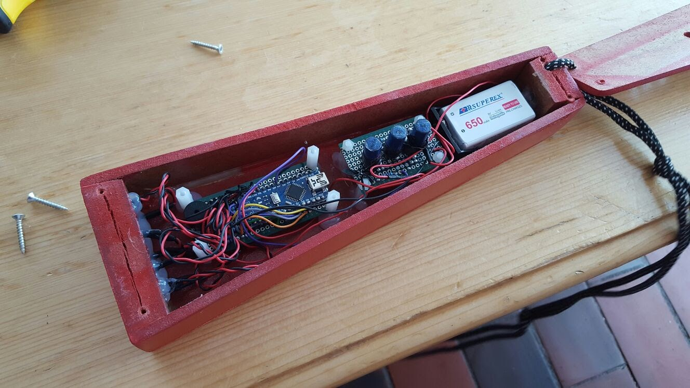

# Fireman Sam Flashlight #

--

In 2016 i experimented a lot with Fischertechnik, Arduino and microelectronics in general.

Because my son Maximilian was a big fan of Fireman Sam at this time as nearly every boy at his age, I decided that if I anyway want to build something, it's going to be a Fireman Sam Flashlight including everything a child of 6 needs... so a sirene, at least 50 meters of light range and so on :).

The result including 5 high performance LEDs, 2 blue LEDs for the sirene, a piezo element which was able to play a sirene sound and the theme Melody of Fireman Sam and 3 buttons to adjust the mode, the brightness and to play the melody you can see below. Additionally I inserted a button between the lithium-ion battery and the board to be able to toggle it of completely.

In a practice test the flashlight was really "evil"... unfortunately the smartphone's sensitivity was not fine enough to capture it in a picture, but the range was about 100 meters and it was by far brighter than the stock flashlight we owned before. Of course it could not compare to really high performance, cooled flashlights, but it was really impressing what you can build in such a short period of time completely from scratch.

--

### The soldering and connection scheme before the soldering action ###

### Upside of the result ###

It's not 100% matching the scheme above because I decided to add another 2 white LEDs in the testing phase for an additional 40% of brightness.

### Down side of the result ###

### Functionality test before glueing everything ###

### All 7 LEDs and the board glued into the self-built housiung ###

### Ready for action ###

Unfortunately the smartphone couldn't catch the real brightness, but it had about 100 meters total range, up to 50 meters you could still see someone else's face clearly... and you went blind instantly if you tried to look straight into the light ;).

### Flashlight in "Sirene Mode" with Dalmatian Punkt (Dot) ###

### Son Maximilian "investigating" the place of accident ;) ###

